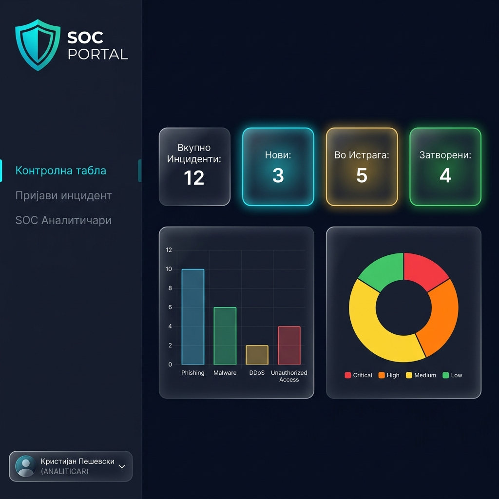
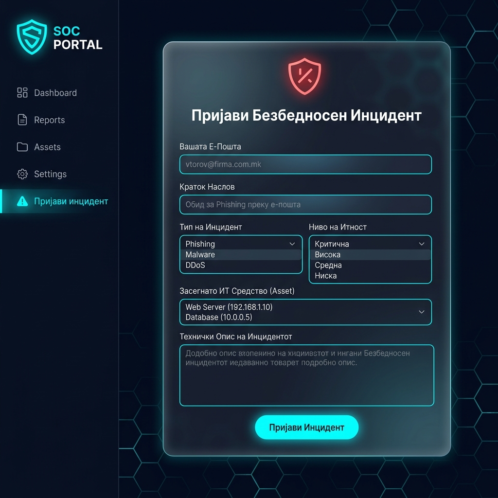
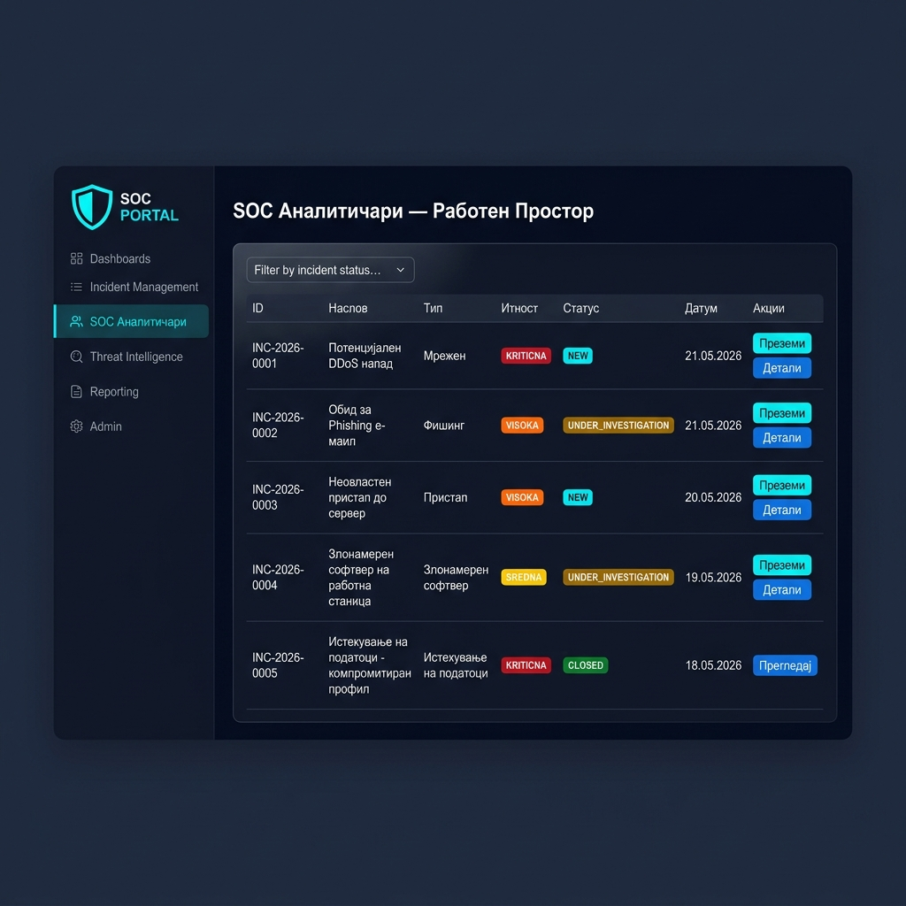

# 🛡️ SOC Portal — Информациски систем за управување со безбедносни инциденти

**Безбедносен оперативен центар (Security Operations Center - SOC)**

Веб-апликација за регистрација, следење и решавање на безбедносни инциденти во рамките на SOC. Системот поддржува три улоги: **Корисник** (пријавува инциденти), **Аналитичар** (ги истражува и затвора) и **Менаџер** (ги надгледува KPI метриките).

**Автор:** Кристијан Пешевски  
**Предмет:** Менаџмент Информациски Системи (МИС)  
**Факултет:** ФИНКИ — Универзитет „Св. Кирил и Методиј", Скопје

---

## 📸 Преглед на интерфејсот

### Контролна табла (Dashboard)
Преглед на клучните KPI метрики: вкупно инциденти, нови, во истрага и затворени. Графикони за распределба по тип и ниво на итност.



### Пријава на инцидент
Форма за пријавување на нов безбедносен инцидент. Корисникот избира тип на напад, ниво на итност и засегнато ИТ средство. Доколку средството е означено како критично, системот автоматски ја зголемува итноста.



### SOC Аналитичари — Работен простор
Табеларен преглед на сите инциденти со можност за филтрирање по статус. Аналитичарот може да преземе тикет (статусот преминува во „Истрага") и потоа да го затвори со внесување на дијагноза и чекори за санација.



---

## 🏗️ Технологии

| Компонента | Технологија |
|---|---|
| **Backend** | Spring Boot 3.3.1, Java 17, Spring Data JPA, Apache XML-RPC Client |
| **Frontend** | React 19, Vite, axios, Vanilla CSS (Dark Mode / Glassmorphism) |
| **ERP срцевина** | Odoo 17.0 (Helpdesk модул проширен со Odoo Studio) |
| **ERP база** | PostgreSQL 15 (на odoo-db сервис) |
| **Аналитичка база** | H2 Database (за KPI и seed податоци) |
| **Контејнеризација** | Docker, Docker Compose (4 сервиси: odoo-db, odoo, backend, frontend) |

## 🔄 Интеграциска архитектура

```
Корисник (React форма)
    │ POST /api/incidents (axios + JSON)
    ▼
Spring Boot (REST контролер)
    │ apache-xmlrpc ➝ execute_kw("helpdesk.ticket", "create", ...)
    ▼
Odoo ERP (Helpdesk + Odoo Studio)
    │ automated action ➝ автоматски приоритет од критичност на средството
    ▼
Odoo Kanban (New → Under Investigation → Solved)
    │ account.analytic.line (timesheet) ➝ SLA KPIs
    ▼
Odoo Dashboard (SLA метрики, реакција, резолуција)
```

## 📂 Дополнителна документација

- `docs/VIDEO_SCENARIO.md` — сценарио за 3-минутна видео презентација на македонски
- `docs/ODOO_SETUP_GUIDE.md` — чекор-по-чекор инсталација на Odoo модули и Studio автоматизации

---

## 🚀 Како да се стартува апликацијата

### Начин 1: Локално (со Maven и npm)

**Предуслови:** Java 17+, Maven, Node.js 20+

**Чекор 1 — Стартување на Backend:**
```bash
cd backend
mvn spring-boot:run
```
Серверот ќе работи на `http://localhost:8080`.

**Чекор 2 — Стартување на Frontend:**
```bash
cd frontend
npm install
npm run dev
```
Апликацијата ќе биде достапна на `http://localhost:5173`.

---

### Начин 2: Со Docker Compose

**Предуслови:** Docker Desktop (стартуван)

```bash
docker compose up --build
```

- **Frontend:** [http://localhost](http://localhost)
- **Backend API:** [http://localhost:8080](http://localhost:8080)

За гасење: `docker compose down`

---

## 📁 Структура на проектот

```
MIS-PROJECT/
├── backend/                # Spring Boot REST API
│   ├── src/
│   │   ├── main/
│   │   │   ├── java/com/soc/portal/
│   │   │   │   ├── controller/     # REST контролери
│   │   │   │   ├── model/          # JPA ентитети (Korisnik, Incident, Asset, Resolution)
│   │   │   │   └── repository/     # Spring Data JPA репозиториуми
│   │   │   └── resources/
│   │   │       ├── application.properties
│   │   │       └── data.sql        # Почетни (seed) податоци
│   ├── Dockerfile
│   └── pom.xml
├── frontend/               # React апликација
│   ├── src/
│   │   ├── components/
│   │   │   ├── Dashboard.jsx       # Контролна табла со KPI
│   │   │   ├── IncidentForm.jsx    # Форма за пријава на инцидент
│   │   │   ├── AnalystWorkspace.jsx # Работен простор за аналитичари
│   │   │   └── ResolutionForm.jsx  # Форма за затворање на инцидент
│   │   ├── App.jsx                 # Главна компонента со навигација
│   │   └── App.css                 # Целосно стилизирање (Dark Mode)
│   ├── Dockerfile
│   ├── nginx.conf
│   └── package.json
├── docker-compose.yml
├── screenshots/
└── README.md
```

---

## 🔄 Тек на работа (Workflow)

```
Корисник пријавува инцидент
        │
        ▼
  ┌─────────────┐
  │  Статус: NEW │
  └──────┬──────┘
         │  Аналитичар го презема
         ▼
  ┌──────────────────────┐
  │ Статус: UNDER_INVESTIGATION │
  └──────────┬───────────┘
             │  Аналитичар го затвора
             ▼
  ┌────────────────┐
  │ Статус: CLOSED  │
  └────────────────┘
         │
         ▼
  KPI метриките се ажурираат
  на контролната табла
```

---

## 👥 Почетни (Seed) корисници

| Име | Улога | Е-Пошта |
|---|---|---|
| Кристијан Пешевски | Аналитичар | kristijan.peshevski@finki.ukim.mk |

| Професор МИС | Менаџер | profesor.mis@finki.ukim.mk |
| Јован Јовановски | Корисник | jovan.jovanovski@company.com |
| Марија Андонова | Корисник | marija.andonova@company.com |
